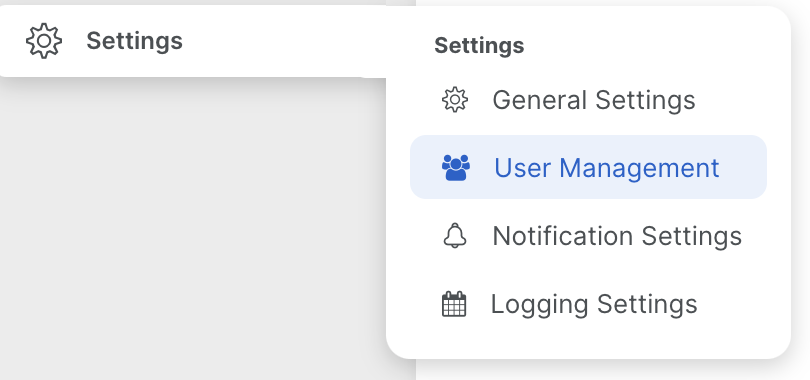
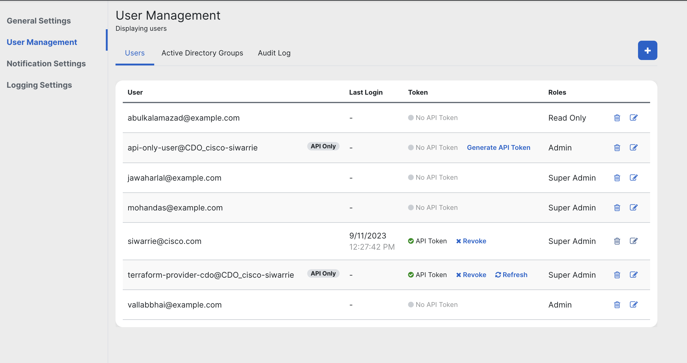
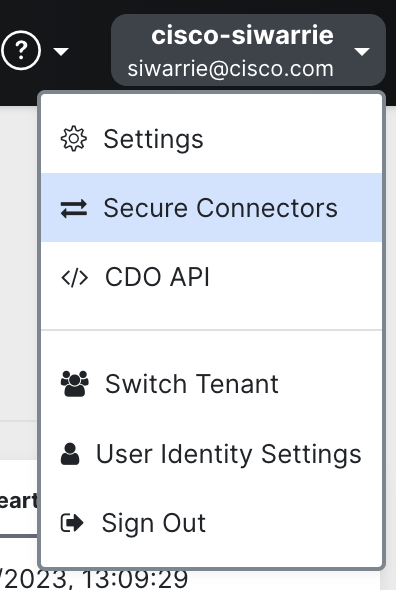
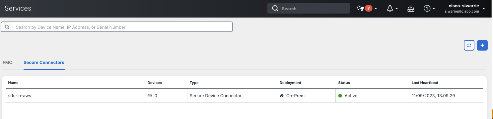

# Terraform: CDO Provider - A complete example

CDO’s Terraform provider allows customers to automate the management of their CDO infrastructure. You can use it to onboard and manage devices, users, and other resources across their CDO environment. 

For example, if you are a Managed Services Provider, your organization may need to, for each new customer, create a new CDO tenant, set up a Secure Device Connector (SDC), onboard the customer’s devices, and add a list of users to manage these resources. The CDO terraform provider makes it easy for you to rapidly create repeatable environments such as these that are managed and version controlled as code.

The following example demonstrates how to use the CDO Terraform provider to rapidly stand up a new CDO tenant.

## Pre-requisites

To use this example, you need the following:
1. A POSIX compliant system like MacOS, Linux, or the Windows Subsystem for Linux.
1. Terraform: This example uses v1.3.
1. Super-admin access to a CDO tenant.
1. An AWS account to automatically spin up an virtual form-factor Adaptive Security Appliance (ASAv) and a Secure Device Connector (SDC). 
  1. The credentials used should allow you permissions to create VPCs, subnets, route tables, network interfaces, and EC2 instances.
  1. 
1. [Optional] A vSphere administrative account to automatically spin up an SDC on your vSphere:
  1. The account used has to have administrative access 

Then, you can clone the example repository from the [CDO Devnet repository](https://github.com/ciscodevnet/terraform-provider-cdo) using Git, and then change your working directory to `examples/complete`.

```
git clone https://github.com/ciscodevnet/terraform-provider-cdo
cd terraform-provider-cdo/examples/complete
```


## Step 1: Create an API Only user with Super-Admin Role

Follow the instructions in the CDO documentation to create an API Only User with Super-Admin role. Copy the API token you have generated and keep it safe. You will need it soon.

## Step 2: (Optional) Set your AWS credentials in your environment

If you want to have the CDO example provider create a sample AWS VPC and subnet to deploy ASAvs and SDCs into your environment, set your AWS credentials in your environment. See the [AWS documentation](https://docs.aws.amazon.com/cli/latest/userguide/cli-configure-envvars.html) to learn more.


## Step 3: Update the variables for your environment

In order to be able to use the CDO Terraform Provider, you need to set a bunch of variables that tell the example about your environment. This can be set by performing the following steps:
- Copy the `terraform.tfvars.sample` file to `terraform.tfvars`:
```
cp terraform.tfvars.sample terraform.tfvars
```
- Edit `terraform.tfvars` and set the values as appropriate. There are two sections in `terraform.tfvars`:
  - The `CDO` section, where you set the CDO Base URL and API token so that the Terraform can communicate with CDO.
  - The `AWS` section; set the values in this section if you want the example code to create resources (an ASAv and an SDC) in AWS.

## Step 4: Run Terraform

- Initialise the modules by running
```
terraform init
```
- Create and review a plan
```
terraform plan -out plan.out
```
- Apply the saved plan
```
terraform apply plan.out
```

### Clean up Resources

To destroy all of the resources created by this Terraform provider, run:
```
terraform destroy
```


## Resources Created: An Explainer

### An AWS VPC with two subnets

In order to allow for the deployment of CDO resources to your AWS account, the Terraform mcode in the `modules/aws_vpc` folder creates the following:
1. An AWS VPC in the `us-east-1` AWS region.
1. A public subnet in the VPC with an internet gateway connected, thereby allowing outbound internet access.
1. A private subnet in the VPC with a NAT gateway for outbound internet access.


### Users
The Terraform code creates a list of users that can use your CDO tenant. You can modify the e-mail addresses of the users here to create your own users. Once this part of the code runs, you can verify this in CDO as follows:
1. Log into your tenant in CDO using a web browser.
1. Click **Settings** -> **User Management**.

1. You should see the created users in the table shown.


### A Secure Device Connector in AWS


The code uses the CDO Terraform Provider to create an SDC in CDO, and then uses the [AWS cdo-sdc](https://registry.terraform.io/modules/CiscoDevNet/cdo-sdc/aws/latest) Terraform module to create an SDC instance in the private subnet of the AWS VPC you created, and initialize it using the bootstrap data for the created SDC. Once this part of the code runs, you can verify this in CDO as follows:
 1. Log into your tenant in CDO using a web browser.
 1. Click on your username on the top right-hand corner of the CDO UI, and click **Secure Connectors**.
 
 1. You should see an SDC called `sdc-in-aws` with the status set to **Active**.
 

 ### A virtual ASA in AWS

 The code uses the `asav` module in `modules/asav` to create an ASAv in your AWS VPC. The ASAv deployed has three interfaces:
 -  An inside interface, in the private subnet.
 - An outside interface, in the public subnet.
 - A management interface, in the private subnet.

 Deploying this ASAv can take up to 15 minutes, so please be patient.

 It then uses the CDO terraform provider to onboard this deployed ASA to CDO.

### An ASA and SDC Resource in CDO

We create ASA and SDC resources in CDO.
- The SDC resource in CDO is created before the SDC in AWS is created, and SDC in AWS receives the CDO bootstrap data from the SDC resource created. Important note: the bootstrap data is valid only for an hour after creation, so make sure you spin up  your SDC in AWS within an hour after creating the CDO resource.
- The ASA resource in CDO is created after the ASA in CDO is spun up.
